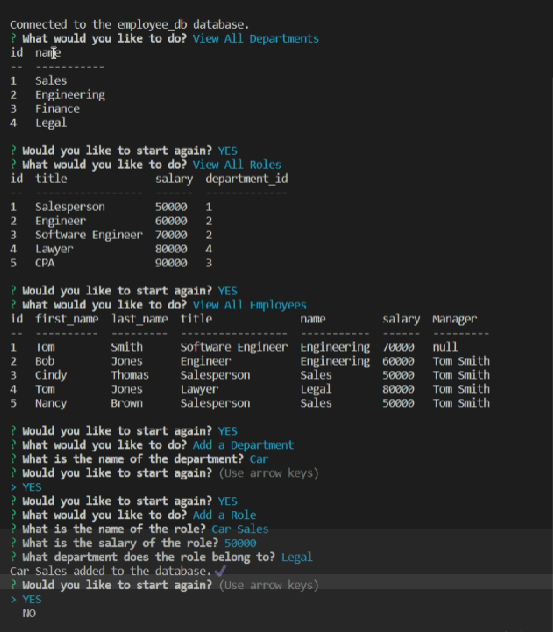

# Employee Tracker 

## Description
A command line application for managing an employee database.

## Screenshot of Application

## Table of Contents
- [Installation](#Installation)
- [Usage](#Usage)
- [License](#License)
- [Contributing](#Contributing)
- [Tests](#Tests)
- [Questions](#Questions)
## Installation
Type "npm start" on the Terminal command line. My password for SQL has been removed for security reasons. You will have to open the program in a code editor and put in your own SQL password. 
## Usage
Open the Terminal in VS Code, run "npm i". Type "mysql -u root -p", to get into MySQL shell. Run "source schema.sql" and then "source seeds.sql" from the command line. 

Go back to Bash in the Terminal and type "npm start" to run the app. Choose one of the prompts and follow the instructions. Select Yes after performing a task to go back to the initial prompt, or select No to shut down the app.
## License
This application is licensed under MIT.
## Contributing
If you would like to contribute to this project, email me at the address below.
## Tests 
None
## Questions
Please email me at johnwilday@yahoo.com with any questions. 
## Walkthrough Video Link
https://drive.google.com/file/d/1riHBzogzuDmACp37IntWkBlKNUoXiOwQ/view

Github Profile: https://github.com/999888Z
